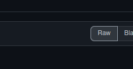

### [Better Discord](https://betterdiscord.app/) Theme Installation

#### Install using Git

If you are a git user, you can install the theme by cloning the repo:

    $ git clone https://github.com/getomni/template.git
  
- The file that you need will be on path: "src/theme/omni-theme.theme.css"

### Download the repo

Download using the [GitHub .zip download](https://github.com/datsfilipe/discord-omni/archive/refs/heads/main.zip) option and unzip them.

- The file that you need will be on path: "src/theme/omni-theme.theme.css"

#### Install manually

1. Step 1

Navigate to [here](https://github.com/datsfilipe/discord-omni/blob/main/src/theme/omni-theme.theme.css)

2. Step 2

Right-click this button:

  

3. Step 3

Select "save ass..." or "save link as..." depending on your navigator

#### Activating theme

1. Step 1

Copy the file "omni-theme.theme.css"

2. Step 2

Go to your Better Discord themes path

3. Step 3

Paste it there and activate it on Better Discord theme section
